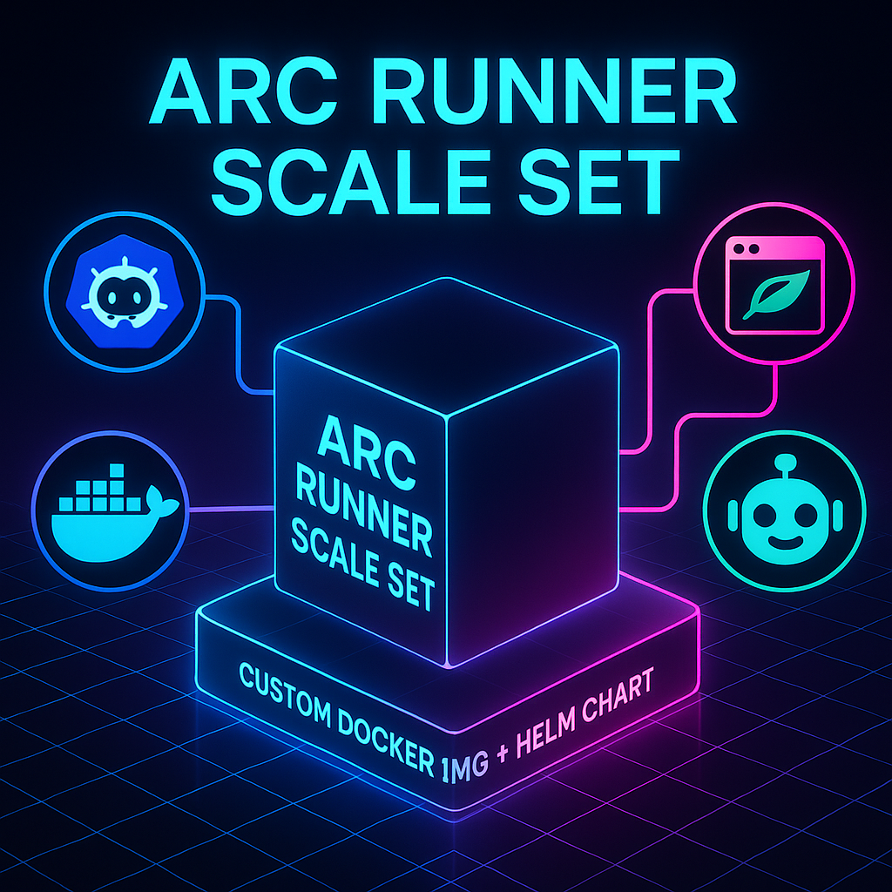

# arc-runner-custom-docker

<p align="center">
  
</p>

This repository shows **two distinct moving parts** you need for self‑hosted GitHub Actions runners on Kubernetes:

| Layer                         | Helm Chart                                                                                                                                 | What it Does                                        | Customization                                                                                        |
| ----------------------------- | ------------------------------------------------------------------------------------------------------------------------------------------ | --------------------------------------------------- | ---------------------------------------------------------------------------------------------------- |
| **1. ARC *Controller***       | [`ghcr.io/actions/actions-runner-controller-charts/gha-runner-scale-set-controller`](https://github.com/actions/actions-runner-controller) | Installs the CRDs & controller that manage runners. | **None** – use upstream image.                                                                       |
| **2. ARC *Runner Scale Set*** | [`ghcr.io/actions/actions-runner-controller-charts/gha-runner-scale-set`](https://github.com/actions/actions-runner-controller-charts)     | Launches Pods that run `actions/runner`.            | **Yes** – we supply a *custom* Docker image containing Node.js 18, Playwright, and Robocorp **rcc**. |

The custom image is built on top of [`ghcr.io/actions/actions-runner:latest`](https://github.com/actions/runner/pkgs/container/runner) and adds:

* **[Playwright](https://playwright.dev/)** and its browser binaries.
* **[Robocorp Command Center CLI (rcc)](https://github.com/robocorp/rcc)** · [Docs](https://robocorp.com/docs/developer-tools/rcc).

---

---

## Table of Contents

* [Features](#features)
* [Prerequisites](#prerequisites)
* [Repository Structure](#repository-structure)
* [Building the Docker Image](#building-the-docker-image)
* [Publishing to GitHub Container Registry (GHCR)](#publishing-to-github-container-registry-ghcr)
* [Kubernetes Secret for GHCR](#kubernetes-secret-for-ghcr)
* [Helm Deployment](#helm-deployment)
* [Configuration Reference](#configuration-reference)

  * [values.yaml](#valuesyaml)
  * [full\_values.yaml](#full_valuesyaml)
* [File Descriptions](#file-descriptions)
* [Contributing](#contributing)
* [License](#license)

---

## Features

* **Base Image –** [`ghcr.io/actions/actions-runner:latest`](https://github.com/actions/runner/pkgs/container/runner)
* **Node.js 18.x** pre‑installed
* **Playwright** (latest) + all required OS libs & browser binaries
* **Robocorp rcc** pre‑installed ([GitHub repo](https://github.com/robocorp/rcc) · [Docs](https://robocorp.com/docs/developer-tools/rcc))
* Helm‑configurable **ARC *Runner Scale Sets*** for horizontal scaling ([Chart repo](https://github.com/actions/actions-runner-controller-charts))

## Prerequisites

* **Docker** (for local image builds)
* **GitHub** PAT or GitHub App credentials
* **`kubectl`** + **Helm 3** (for Kubernetes deployments)
* Access to a **Kubernetes** cluster (K3s, Kind, EKS, etc.)

## Repository Structure

```text
├── conda.yaml                # Conda environment spec
├── robot.yaml                # Robot configuration
├── create-ghcr-secret.sh     # Generates a Kubernetes secret for GHCR auth
├── install.sh                # Installs ARC & the scale set via Helm
├── full_values.yaml          # Complete values reference w/ examples & comments
├── dind-custom-playwright    # Custom build for Dind + Playwright
│   ├── Dockerfile            # Dockerfile for Dind + Playwright
│   └── values.yaml           # Helm values for Dind + Playwright
├── fetch-repos               # Custom build for fetching repos
│   ├── Dockerfile            # Dockerfile for Fetch Repos
│   └── values.yaml           # Helm values for Fetch Repos
├── ror                       # Custom build for Room of Requirement
│   ├── Dockerfile            # Dockerfile for ROR
│   └── values.yaml           # Helm values for ROR
└── README.md                 # Project documentation (this file)
```

## Building the Docker Image

1. **Clone** the repo:

   ```bash
   git clone https://github.com/your-org/arc-runner-custom-docker.git
   cd arc-runner-custom-docker
   ```
2. **Build** locally:

   ```bash
   docker build -t ghcr.io/<your-org>/custom-arc-runner:latest .
   ```
3. *(Optional)* **Test** the toolchains:

   ```bash
   docker run --rm ghcr.io/<your-org>/custom-arc-runner:latest playwright --version
   docker run --rm ghcr.io/<your-org>/custom-arc-runner:latest rcc --version
   ```

## Publishing to GitHub Container Registry (GHCR)

1. **Login** to GHCR:

   ```bash
   echo $GHCR_PAT | docker login ghcr.io -u <your‑username> --password-stdin
   ```
2. **Tag & push**:

   ```bash
   docker tag custom-arc-runner:latest ghcr.io/<your-org>/custom-arc-runner:latest
   docker push ghcr.io/<your-org>/custom-arc-runner:latest
   ```

## Kubernetes Secret for GHCR

Allow the cluster to pull your image:

```bash
chmod +x create-ghcr-secret.sh
./create-ghcr-secret.sh   # generates ghcr-login-secret.yaml
kubectl apply -f ghcr-login-secret.yaml -n <runner-namespace>
```

## Helm Deployment

`install.sh` wraps Helm to install **ARC** *and* your **Scale Set**:

```bash
chmod +x install.sh
./install.sh
```

Under the hood it runs something equivalent to:

```bash
helm repo add arc https://actions-runner-controller.github.io/actions-runner-controller
helm upgrade --install arc arc/actions-runner-controller \
  --namespace arc-system --create-namespace

helm upgrade --install custom-runners \
  oci://ghcr.io/actions/actions-runner-controller-charts/gha-runner-scale-set \
  --namespace arc-runners -f values.yaml
```

---

## Configuration Reference

### values.yaml

A **minimal** scale‑set configuration – edit the placeholders:

```yaml
githubConfigUrl: "https://github.com/<your-org>/<your-repo>"
githubConfigSecret:
  github_token: "<YOUR_GITHUB_PAT>"
runnerScaleSetName: "custom-runner-scale-set"
containerMode:
  type: "dind"   # Docker‑in‑Docker

template:
  spec:
    containers:
      - name: runner
        image: ghcr.io/<your-org>/custom-arc-runner:latest
        imagePullPolicy: Always
        command: ["/home/runner/run.sh"]
        resources:
          requests:
            cpu: "1"
            memory: "2Gi"
          limits:
            cpu: "4"
            memory: "8Gi"
```

### full\_values.yaml

Every configurable knob with comments:

```bash
cp full_values.yaml values.custom.yaml
helm upgrade --install custom-runners \
  oci://ghcr.io/actions/actions-runner-controller-charts/gha-runner-scale-set \
  --namespace arc-runners -f values.custom.yaml
```

---

## File Descriptions

| File                      | Purpose                                                       |
| ------------------------- | ------------------------------------------------------------- |
| **Dockerfile**            | Builds the custom runner image with Node.js, Playwright & rcc |
| **create-ghcr-secret.sh** | Generates a pull‑secret YAML for GHCR                         |
| **values.yaml**           | Quick‑start Helm values                                       |
| **full\_values.yaml**     | Fully‑documented values reference                             |
| **install.sh**            | Automates ARC + Scale Set install                             |

## Contributing

1. **Fork** the repo
2. `git checkout -b feature/<your-feature>`
3. Commit & push
4. **Open a PR**

---

## License

MIT – see the [LICENSE](LICENSE) file for details.
